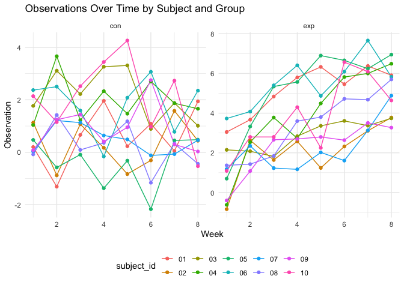
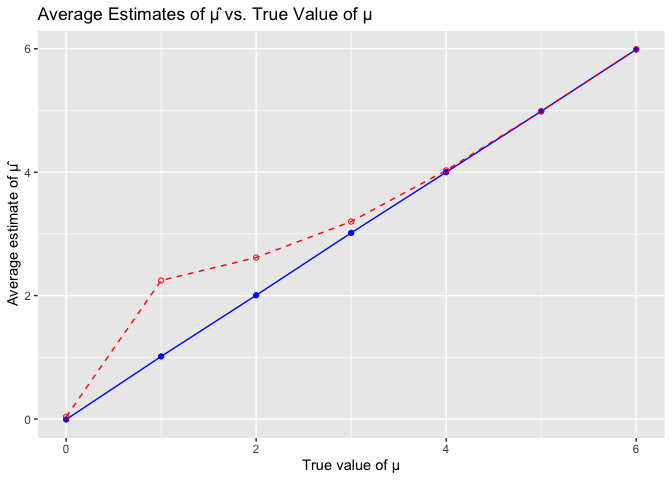

p8105_hw5_xw2962
================
Xiaoyu Wu
2023-11-04

``` r
library(dplyr)
library(tidyverse)
library(readr)
library(rvest)
library(purrr)
library(broom)
library(tidyr)
library(ggplot2)
```

## Problem One

#### Import Raw Data

``` r
homicide_df= 
  read_csv("./data/homicide-data.csv")|>
  janitor::clean_names() 
```

#### Describe the Raw Data

The dataset homicide_df has 12 variables: uid, reported_date,
victim_last, victim_first, victim_race, victim_age, victim_sex, city,
state, lat, lon, disposition. And in this dataset, there are 52179 rows.
And there are 12 columns. Here, we consider variables: reported_date,
victim_race, victim_age, victim_sex, city, state, lat, lon and
disposition important for analysis.

#### Summarize within Cities

``` r
city_summary=
  homicide_df |> 
  mutate(city_state = paste(city, state, sep = ", "),
# create a city_state variable
         unsolved = disposition %in% c('Closed without arrest', 'Open/No arrest')) |> 
  group_by(city_state) |> 
  summarise(
    total_homicides = n(),
# summarize within cities to obtain the total number of homicides
    unsolved_homicides = sum(unsolved)
  ) |> 
# summarize within cities to obtain the number of unsolved homicides
  ungroup() 
city_summary=city_summary[city_summary$city_state!="Tulsa, AL",]
city_summary
```

    ## # A tibble: 50 × 3
    ##    city_state      total_homicides unsolved_homicides
    ##    <chr>                     <int>              <int>
    ##  1 Albuquerque, NM             378                146
    ##  2 Atlanta, GA                 973                373
    ##  3 Baltimore, MD              2827               1825
    ##  4 Baton Rouge, LA             424                196
    ##  5 Birmingham, AL              800                347
    ##  6 Boston, MA                  614                310
    ##  7 Buffalo, NY                 521                319
    ##  8 Charlotte, NC               687                206
    ##  9 Chicago, IL                5535               4073
    ## 10 Cincinnati, OH              694                309
    ## # ℹ 40 more rows

#### Estimate the Proportion of Homicides that are Unsolved for Baltimore

``` r
baltimore_df = homicide_df  |>
  mutate(city_state = paste(city, state, sep = ", ")) |>
  filter(city_state == "Baltimore, MD")
# filter for Baltimore, MD
prop_test_result = prop.test(x = sum(baltimore_df$disposition %in% c("Closed without arrest", "Open/No arrest")),
                             n = nrow(baltimore_df),
                             correct = FALSE) 
# perform the proportion test for Baltimore
tidy_result = broom::tidy(prop_test_result)
# save the output and apply broom::tidy to get a tidy dataframe
estimated_proportion = tidy_result$estimate
estimated_proportion
```

    ##         p 
    ## 0.6455607

``` r
conf_low = tidy_result$conf.low
conf_low
```

    ## [1] 0.6277411

``` r
conf_high = tidy_result$conf.high
conf_high
```

    ## [1] 0.6629852

``` r
# pull the estimated proportion and confidence intervals from the resulting tidy dataframe
```

#### Run prop.test for each City

``` r
city_prop_test_results = city_summary  |> 
  mutate(
    prop_test_result = map2(unsolved_homicides, total_homicides, ~prop.test(x = .x, n = .y)),
# run prop.test for each of the cities in your dataset
    tidy_result = map(prop_test_result, broom::tidy)
  ) |>
  select(city_state, tidy_result) |>
  unnest(tidy_result) |>
  select(-statistic, -p.value,-parameter, -method, -alternative) 
# create a tidy dataframe with estimated proportions and CIs for each city
print(city_prop_test_results)
```

    ## # A tibble: 50 × 4
    ##    city_state      estimate conf.low conf.high
    ##    <chr>              <dbl>    <dbl>     <dbl>
    ##  1 Albuquerque, NM    0.386    0.337     0.438
    ##  2 Atlanta, GA        0.383    0.353     0.415
    ##  3 Baltimore, MD      0.646    0.628     0.663
    ##  4 Baton Rouge, LA    0.462    0.414     0.511
    ##  5 Birmingham, AL     0.434    0.399     0.469
    ##  6 Boston, MA         0.505    0.465     0.545
    ##  7 Buffalo, NY        0.612    0.569     0.654
    ##  8 Charlotte, NC      0.300    0.266     0.336
    ##  9 Chicago, IL        0.736    0.724     0.747
    ## 10 Cincinnati, OH     0.445    0.408     0.483
    ## # ℹ 40 more rows

``` r
# print the resulted dataframe 
```

#### Create a Plot that Shows the Estimates and CIs for each City

``` r
ggplot(city_prop_test_results, aes(x = reorder(city_state, estimate), y = estimate)) +
  geom_point() +
# create a point plot that shows the estimates and CIs for each city and organize cities according to the proportion of unsolved homicides.
  geom_errorbar(aes(ymin = conf.low, ymax = conf.high), width = 0.2) +
# check out geom_errorbar
  coord_flip() +  
# flips the axes to make it easier to read city names
  labs(x = "City", y = "Proportion of Unsolved Homicides",
       title = "Proportion of Unsolved Homicides with Confidence Intervals",
       subtitle = "For major cities as reported by The Washington Post") +
# add title, subtitle and axis labels
  theme_minimal()
```

<!-- -->

``` r
# edit the theme 
```

## Problem Two

#### Start with a Dataframe Containing all File Names

``` r
data_path = "./data/problem_2_data/"
file_names = list.files(path = data_path, full.names = TRUE)
# create a dataframe of all file names
```

#### Iterate over File Names and Read in Data for each Subject

``` r
files_df = data.frame(file_path = file_names) |>
# create a dataframe with file names and extract relevant parts: subject ID and arm 
  mutate(file_name = basename(file_path),
         subject_id = sub(".*_(\\d+).csv", "\\1", file_name), 
# extract subject ID
         arm = substr(file_name, 1, 3)) 
# determine the arm

read_data = function(file_path) {
  read_csv(file_path) |>
    gather(key = "week", value = "observation") 
}
# iterate over file names and read in data for each subject by creating a function 
files_df = files_df |>
  mutate(data = map(file_path, read_data))
# map all files to the function created 
```

#### Tidy the Result

``` r
tidy_df = files_df  |> 
  select(-file_path, -file_name)  |> 
  unnest(data) |> 
  mutate(week = as.numeric(gsub("week_", "", week)))
# tidy the resulting dataset 
tidy_df
```

    ## # A tibble: 160 × 4
    ##    subject_id arm    week observation
    ##    <chr>      <chr> <dbl>       <dbl>
    ##  1 01         con       1        0.2 
    ##  2 01         con       2       -1.31
    ##  3 01         con       3        0.66
    ##  4 01         con       4        1.96
    ##  5 01         con       5        0.23
    ##  6 01         con       6        1.09
    ##  7 01         con       7        0.05
    ##  8 01         con       8        1.94
    ##  9 02         con       1        1.13
    ## 10 02         con       2       -0.88
    ## # ℹ 150 more rows

#### Make a Spaghetti Plot

``` r
spaghetti_plot = ggplot(tidy_df, aes(x = week, y = observation, color = subject_id)) +
  geom_line() +
  geom_point()+
# make a Spaghetti Plot and set the transparency level to 0.4 
  facet_wrap(~ arm, scales = 'free_y') +  
# Separating the groups into different arms 
  theme_minimal() +
  labs(title = "Observations Over Time by Subject and Group",
       x = "Week",
       y = "Observation",
       color = "subject_id") +
# add title and axis labels 
  theme(legend.position = "bottom")
print(spaghetti_plot)
```

<!-- -->

``` r
# print result 
```

#### Comments on Differences between Groups

Unlike the control group, the experimental group’s subjects have
observation values increasing overtime and have a clear increasing
trend. The observation values for control group fluctuate between -2 and
4. Whereas, the observation values for experimental group increase from
0 to around 8. And compared to control group, the mean values of
observations of each subject are higher in experimental group.

## Problem Three

#### Simulation

``` r
# Set the design elements
n = 30          
# Sample size
sigma = 5       
# Standard deviation
mu_values = 0:6 
# True mean values under the alternative hypothesis
num_datasets = 5000  
# Number of datasets to generate
alpha = 0.05        
# Significance level

simulation_results = list()
# Create an empty list to store the results

for (mu in mu_values) {
  datasets = replicate(num_datasets, {
    sample_data = rnorm(n, mean = mu, sd = sigma)
    t_test_result = t.test(sample_data, mu = 0)
    tidy(t_test_result)[, c("estimate", "p.value")]
  }, simplify = FALSE)  |> 
# Use replicate to generate n_datasets data frames and combine them into a list
    bind_rows()  |>
# Convert the list of tibbles into one tibble
    rename(mu_hat = estimate, p_value = p.value)  |> 
# Name the columns correctly
    mutate(true_mu = mu, rejected = p_value < alpha)
# Add the true mu value and a rejection indicator
  
simulation_results[[as.character(mu)]] = datasets
}
# Add the results to the main list

simulation_results = bind_rows(simulation_results, .id = "true_mu")  |> 
  mutate(true_mu = as.numeric(true_mu))
# Combine all the results into one tibble

print(simulation_results)
```

    ## # A tibble: 35,000 × 4
    ##     mu_hat p_value true_mu rejected
    ##      <dbl>   <dbl>   <dbl> <lgl>   
    ##  1  0.592    0.514       0 FALSE   
    ##  2  0.337    0.645       0 FALSE   
    ##  3  0.0246   0.977       0 FALSE   
    ##  4 -0.279    0.765       0 FALSE   
    ##  5  0.498    0.602       0 FALSE   
    ##  6 -0.966    0.297       0 FALSE   
    ##  7 -1.10     0.364       0 FALSE   
    ##  8  0.269    0.774       0 FALSE   
    ##  9  0.0427   0.961       0 FALSE   
    ## 10 -0.669    0.482       0 FALSE   
    ## # ℹ 34,990 more rows

``` r
power_and_estimates = simulation_results |>
  group_by(true_mu)  |> 
  summarise(
    power = mean(rejected),
    average_mu_hat = mean(mu_hat)
  )
# Calculate power and average estimates
print(power_and_estimates)
```

    ## # A tibble: 7 × 3
    ##   true_mu  power average_mu_hat
    ##     <dbl>  <dbl>          <dbl>
    ## 1       0 0.0526       -0.00824
    ## 2       1 0.189         1.01   
    ## 3       2 0.565         2.01   
    ## 4       3 0.891         3.02   
    ## 5       4 0.987         4.00   
    ## 6       5 0.999         4.99   
    ## 7       6 1.00          5.99

#### Make a plot showing the the power of the test on the y axis and the true value of μ on the x axis.

``` r
ggplot(power_and_estimates, aes(x = true_mu, y = power)) +
  geom_point() +
  geom_line() +
  labs(x = "True value of μ", y = "Power of the test", title = "Power vs. True value of μ") +
  theme_minimal()
```

<!-- -->

#### Description.

As the true mean μ increases (thus increasing the effect size), the
power of the test also increases. This happens because as the true mean
deviates more from the null hypothesis mean (μ=0 in this case), it
becomes easier for the t-test to detect a significant difference, thus
increasing the likelihood of rejecting the null hypothesis when it is
indeed false.

#### Make a plot showing the average estimate of μ̂ on the y axis and the true value of μ on the x axis.

``` r
ggplot(power_and_estimates, aes(x = true_mu, y = average_mu_hat)) +
  geom_point() +
  geom_line() +
  labs(x = "True value of μ", y = "Average estimate of μ̂", title = "Average estimate of μ̂ vs. True value of μ") +
  theme_minimal()
```

<!-- -->

#### Description.

The analysis indicates that the average estimated mean closely
corresponds to the true mean, conforming to a relationship that can be
most accurately described by the linear equation y=x.

#### Make a second plot (or overlay on the first) the average estimate of μ̂ only in samples for which the null was rejected on the y axis and the true value of μ on the x axis.

``` r
average_estimates = simulation_results  |> 
  group_by(true_mu)  |> 
  summarise(
    average_mu_hat = mean(mu_hat),
    average_mu_hat_rejected = mean(mu_hat[rejected])
  )
# Calculate the average mu_hat and average mu_hat when null is rejected

ggplot(average_estimates, aes(x = true_mu)) +
  geom_line(aes(y = average_mu_hat), color = 'blue') +
  geom_line(aes(y = average_mu_hat_rejected), color = 'red', linetype = "dashed") +
  geom_point(aes(y = average_mu_hat), color = 'blue') +
  geom_point(aes(y = average_mu_hat_rejected), color = 'red', shape = 1) +
  labs(x = "True value of μ", y = "Average estimate of μ̂",
       title = "Average Estimates of μ̂ vs. True Value of μ")
```

<!-- -->

``` r
# Plot the power of the test and the average estimates of μ̂
```

#### Discussion

This plot compares the average estimated mu with the true mu. The blue
line shows the average estimate across all tests, and the red line shows
the average estimate when the null hypothesis is rejected.

No, the sample average of μ^. across tests for which the null is
rejected is not always approximately equal to the true value of μ. This
discrepancy is because when the null hypothesis is true (or the true
effect is very small), rejecting the null hypothesis is often a result
of sampling variability that leads to an overestimation of the true
effect size.

This could be due to a Type II error, which occurs when a false null
hypothesis is not rejected. As the true mean (μ) increases, the rate of
Type II error decreases, enhancing the test’s power. This results in a
greater likelihood of rejecting the null hypothesis and yields a more
precise estimation of the μ value.
